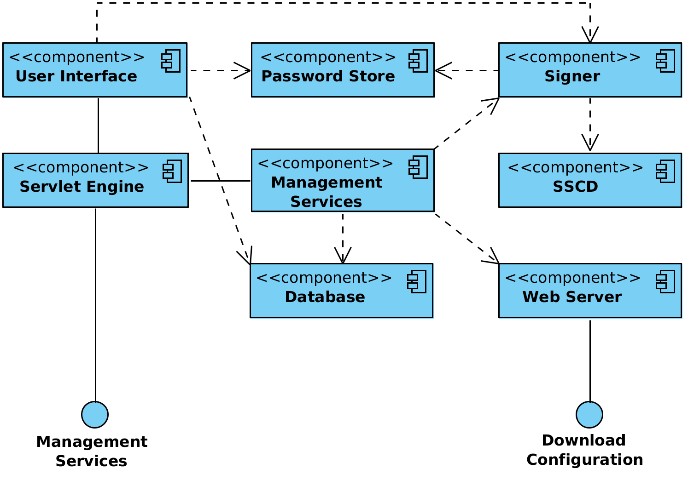
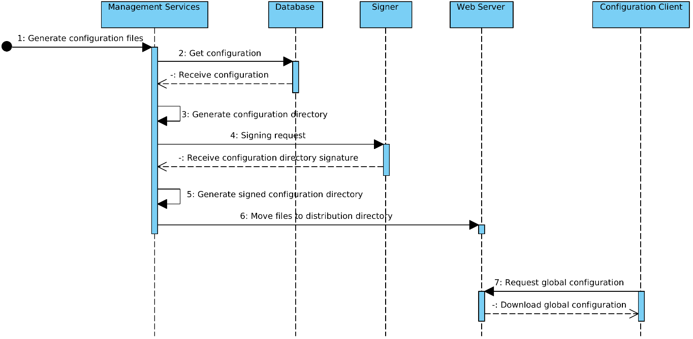
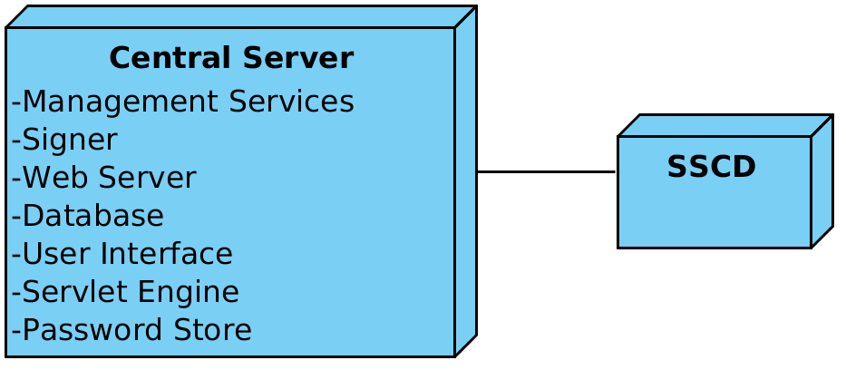

---

# X-Road: Central Server Architecture
**Technical Specification**

Version: 2.5  
Doc. ID: ARC-CS

## Version history

 Date       | Version | Description                                                     | Author
 ---------- | ------- | --------------------------------------------------------------- | --------------------
 02.06.2015 | 0.1     | Initial version                                                 | Ilja Kromonov
 02.07.2015 | 0.2     | Comments and editorial changes                                  | Margus Freudenthal
 03.07.2015 | 0.3     | Component diagram updated; configuration generation sequence and simple deployment diagrams added | Ilja Kromonov
 09.07.2015 | 0.4     | Minor fixes; Data model reference                               | Ilja Kromonov
 27.08.2015 | 0.5     | Section on high availability added                              | Marju Ignatjeva
 10.09.2015 | 0.6     | Format and captions of figures edited                           | Marju Ignatjeva
 10.09.2015 | 0.7     | Technology matrix added; editorial changes                      | Ilja Kromonov
 15.09.2015 | 0.8     | Audit log added                                                 | Kristo Heero
 16.09.2015 | 0.9     | Incorporated feedback from Vitali                               | Margus Freudenthal
 16.09.2015 | 1.0     | Editorial changes made                                          | Imbi Nõgisto
 16.09.2015 | 1.1     | Postgres new number                                             | Margus Freudenthal
 17.09.2015 | 2.0     | Editorial changes made                                          | Imbi Nõgisto
 21.10.2015 | 2.1     | SSCD and password store related information added               | Ilja Kromonov
 24.02.2017 | 2.2     | Converted to Github flavoured Markdown, added license text, adjusted tables for better output in PDF | Toomas Mölder
 19.01.2018 | 2.3     | Matrix of technologies moved to ARC-TEC-file and chapters reordered | Antti Luoma 
 02.03.2018 | 2.4     | Moved terms and abbreviations into the terms document           | Tatu Repo
 11.08.2021 | 2.5     | Update chapter 5.2 about high-availability setup                | Ilkka Seppälä

## Table of Contents

<!-- toc -->

- [X-Road: Central Server Architecture](#x-road-central-server-architecture)
  - [Version history](#version-history)
  - [Table of Contents](#table-of-contents)
  - [License](#license)
  - [1 Introduction](#1-introduction)
    - [1.1 Overview](#11-overview)
    - [1.2 Terms and Abbreviations](#12-terms-and-abbreviations)
    - [1.3 References](#13-references)
  - [2 Component View](#2-component-view)
    - [2.1 Web Server](#21-web-server)
    - [2.2 Management Services](#22-management-services)
    - [2.3 Signer](#23-signer)
    - [2.4 Database](#24-database)
    - [2.5 User Interface](#25-user-interface)
    - [2.6 Servlet Engine](#26-servlet-engine)
    - [2.7 Password Store](#27-password-store)
    - [2.8 SSCD](#28-sscd)
  - [3 Interfaces](#3-interfaces)
    - [3.1 Management Services](#31-management-services)
    - [3.2 Download Configuration](#32-download-configuration)
  - [4 Configuration Creation Workflow](#4-configuration-creation-workflow)
  - [5 Deployment View](#5-deployment-view)
    - [5.1 Simple Deployment](#51-simple-deployment)
    - [5.2 Deployment in High Availability Setup](#52-deployment-in-high-availability-setup)

<!-- tocstop -->

## License

This document is licensed under the Creative Commons Attribution-ShareAlike 3.0 Unported License. To view a copy of this license, visit http://creativecommons.org/licenses/by-sa/3.0/

## 1 Introduction

This document describes the architecture of the X-Road central server. For more information about X-Road and the role of the central server see \[[ARC-G](#Ref_ARC-G)\].

This document presents an overview of the components of the central server and the interfaces between these components. It is aimed at technical readers who want to acquire an overview of inner workings of the central server.

### 1.1 Overview

The central server manages the database of X-Road members and security servers. In addition, the central server contains the security policy of the X-Road instance. The security policy consists of the following items:

-   list of trusted certification authorities,

-   list of trusted time-stamping authorities,

-   tunable parameters such as maximum allowed lifetime of an OCSP response.

Both the member database and the security policy are made available to the security servers via HTTP protocol (see [Section 3.2](#32-download-configuration)). This distributed set of data forms the global configuration.

In addition to configuration distribution, the central server provides interface for performing management tasks such as adding and removing security server clients. These tasks are invoked from the user interface of the security servers. The management services are implemented as standard X-Road services and are offered via the central security server. See [Section 3.1](#31-management-services) for details.

### 1.2 Terms and Abbreviations

See X-Road terms and abbreviations documentation \[[TA-TERMS](#Ref_TERMS)\].

### 1.3 References

1. \[ARC-G\] Cybernetica AS. X-Road Architecture. Document ID: [ARC-G](arc-g_x-road_arhitecture.md).

2. \[DM-CS\] Cybernetica AS. X-Road: Central Server Configuration. Document ID: [DM-CS](../DataModels/dm-cs_x-road_central_server_configuration_data_model.md).

3. \[PR-GCONF\] Cybernetica AS. X-Road: Protocol for Downloading Configuration. Document ID: [PR-GCONF](../Protocols/pr-gconf_x-road_protocol_for_downloading_configuration.md).

4. \[PR-MESS\] Cybernetica AS. X-Road: Profile of Messages. Document ID: [PR-MESS](../Protocols/pr-mess_x-road_message_protocol.md).

5. \[PR-MSERV\] Cybernetica AS. X-Road: Management Services Protocol. Document ID: [PR-MSERV](../Protocols/pr-mserv_x-road_protocol_for_management_services.md).

6. \[SPEC-AL\] Cybernetica AS. X-Road: Audit log events.

7. \[PKCS11\] Cryptographic Token Interface Standard. RSA Laboratories, PKCS\#11.

8. \[ARC-TEC\] X-Road technologies. Document ID: [ARC-TEC](arc-tec_x-road_technologies.md).

9. \[TA-TERMS\] X-Road Terms and Abbreviations. Document ID: [TA-TERMS](../terms_x-road_docs.md).

10. \[IG-CSHA\] Central Server High Availability Installation Guide. Document ID: [IG-CSHA](../Manuals/ig-csha_x-road_6_ha_installation_guide.md).

## 2 Component View

[Figure 1](#Ref_Components_and_interfaces_of_the_X_Road_central_server) shows the main components and interfaces of the X-Road central server. The components and the interfaces are described in detail in the following sections.

Figure 1. Components and interfaces of the X-Road central server

Technologies used in the central server can be found here: \[[ARC-TEC](#Ref_ARC-TEC)\]

### 2.1 Web Server

The global configuration files generated by the central server need to be made available to configuration clients. The HTTP-based protocol used for downloading configuration is described in \[[PR-GCONF](#Ref_PR-GCONF)\]. Technically, the configuration consists of a set of files that are shared out using standard web server (nginx\[[1](#Ref_1)\] web server is used). The global configuration generation is handled by the management services component.

\[1\] See <http://nginx.org/> for details.

### 2.2 Management Services

A collection of services including:

-   management services that are used by security servers to perform management tasks such as registering a security server client or deleting an authentication certificate;

-   internal service for generating the global configuration.

The configuration generation service (periodically invoked by a cron\[[2](#Ref_2)\] job) prepares and signs the global configuration files and then copies them to the web server's distribution directory where they are distributed via standard means. See [Section 4](#4-configuration-creation-workflow) for details on configuration distribution.

\[2\] See <http://pubs.opengroup.org/onlinepubs/9699919799/utilities/crontab.html> for details.

### 2.3 Signer

The signer component is responsible for managing the keys and certificates used for signing the global configuration. The signer is called from the management services component to create the signature for the configuration.

### 2.4 Database

The central server holds the X-Road configuration in a PostgreSQL\[[3](#Ref_3)\] database. The database contains the security policy of the X-Road instance as well as a list of members, security servers, global groups and management services. For a detailed description of the central server configuration refer to \[[DM-CS](#Ref_DM-CS)\]. The configuration can be modified through the central server user interface and management services.

\[3\] See <http://www.postgresql.org/> for details.

### 2.5 User Interface

The central server user interface allows a user to manage X-Road members and security servers and define the global configuration parameters that are distributed to the security servers.

User action events that change the system state or configuration are logged into the audit log. The actions are logged regardless of whether the outcome was a success or a failure. The complete list of the audit log events is described in \[[SPEC-AL](#Ref_SPEC-AL)\].

### 2.6 Servlet Engine

The Jetty\[[4](#Ref_4)\] servlet engine hosts the user interface and management services, listening on ports that are configurable in the X-Road configuration files.

\[4\] See <http://www.eclipse.org/jetty/> for details.

### 2.7 Password Store

Stores security token passwords in a shared memory segment of the operating system that can be accessed by the central server interface and signer. Allows security token logins to persist, until the central server is restarted, without compromising the passwords.

### 2.8 SSCD

The SSCD (Secure Signature Creation Device) is an optional hardware component that provides secure cryptographic signature creation capability to the signer.

The SSCD needs to be a PKCS \#11 (see \[[PKCS11](#Ref_PKCS11)\]) compliant hardware device that can be optionally used by the central server for signing the generated global configuration files it generates. The use of the interface requires that a PKCS \#11 compliant device driver is installed and configured in the central server system.

## 3 Interfaces

### 3.1 Management Services

Management services are called by security servers to perform management tasks such as registering a security server client or deleting an authentication certificate.

The management service interface is a synchronous RPC-style interface provided by the central server. The service is called by security servers.

The interface is described in more detail in \[[ARC-G](#Ref_ARC-G)\], \[[PR-MSERV](#Ref_PR-MSERV)\].

### 3.2 Download Configuration

Configuration clients download the generated global configuration files from the central server.

The configuration download interface is a synchronous interface provided by the central server. It is used by configuration clients such as security servers and configuration proxies.

The interface is described in more detail in \[[ARC-G](#Ref_ARC-G)\], \[[PR-GCONF](#Ref_PR-GCONF)\].

## 4 Configuration Creation Workflow

X-Road central server periodically assembles the global configuration, consisting of XML files describing private and shared parameters, as well as any additional configuration parts installed by add-ons (see \[[PR-GCONF](#Ref_PR-GCONF)\] for detailed information about configuration structure).

Configuration files are distributed in accordance with the protocol for downloading configuration (see [Section 3.2](#32-download-configuration)). MIME messages are generated to represent internal and external configuration directories of the X-Road instance.

The central server implements two configuration sources. The internal source distributes files to security servers belonging to the same X-Road instance as the central server. The external source distributes configuration files to security servers of other federated X-Road instances. Both sources can contain different set of configuration files, depending on the central server's configuration.

The process of generating and distributing the configuration is the same for both configuration sources.

1.  A cron job sends a request to generate the global configuration files.

2.  The contents of the files are taken from central server's database. The files are saved to a temporary location.

3.  Management services component generates configuration directory referencing the generated files.

4.  Management services component sends a signing request (containing hash of the directory) to the signer component. Signer signs the hash and responds with the signature.

5.  Management services component updates the configuration directory to contain the received signature.

6.  Management services component moves the configuration files to the distribution directory of the web server.

7.  Security servers make HTTP requests and download the configuration.

This process is illustrated in the sequence diagram in [Figure 2](#Ref_The_process_of_global_configuration_and_distribution).

Figure 2. The process of global configuration generation and distribution

## 5 Deployment View

### 5.1 Simple Deployment

This section describes a simple scenario where the central server is installed on a standalone server without the use of redundancy. The signing key is stored on a HSM device. This setup is useful for testing environments and for X-Road instances where availability is not of critical concern.

Figure 3. Simple deployment of the central server

Optionally, an SSCD can be connected with the central server if global configuration signatures are to be provided by a cryptographic hardware device.

### 5.2 Deployment in High Availability Setup

This section describes the deployment of the central server in a cluster, for achieving high availability.

The High Availability (HA) solution for the X-Road central server relies on a shared, optionally highly available database. There can be multiple central server nodes each connecting to the same database instance. Furthermore, the database can be set up in high-availability mode where there is the primary node with read/write access and one or more secondary read-only nodes replicating the primary data as it changes.

In a high availability setup, the configuration clients can use any of the nodes for downloading configuration. It is up to the client implementations to choose the algorithm for selecting this node at each particular download attempt.

The central server's high availability is described in more detail in the document \[[IG-CSHA](#Ref_IG-CSHA)\].
